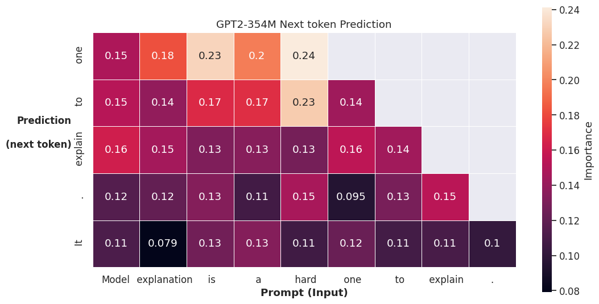
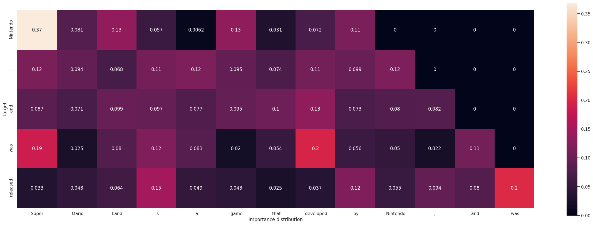

# ReAGent: A Model-agnostic Feature Attribution Method for Generative Language Models

<p align="center">

</p>

## Environment Setup

We are running experiments with Python 3.10

### Making virtual environment

#### (Option 1) With conda

1. install anaconda/miniconda
2. create a conda environment `conda create -n env-reagent python=3.10`
3. activate environment `source activate env-reagent`
4. install package dependencies `pip install -r requirements.txt`

#### (Option 2) With venv

1. install python 3.10
2. create a virtual environment `python3 -m venv .venv`
3. activate environment `source .venv/bin/activate`
4. install package dependencies `pip install -r requirements.txt`

### Initialize NLTK

Run the following command

```sh
python setup_nltk.py
```

## Demo notebook

Open and run the jupyter notebook `src/notebook.ipynb`. You may see outputs like:

### Importance distribution plots

<p align="center">

</p>

### Evaluation Metrics

| target_pos | target_token | source_soft_ns | source_soft_nc | rand_soft_ns | rand_soft_nc |
| --- | --- | --- | --- | --- | --- |
| 10 | Nintendo | 0.000 | 0.004 | 0.000 | 0.019 |
| 11 | , | 0.255 | 0.017 | 0.000 | 0.007 |
| 12 | and | 0.000 | 0.006 | 0.004 | 0.017 |
| 13 | was | 0.008 | 0.008 | 0.000 | 0.006 |
| 14 | released | 0.027 | 0.005 | 0.000 | 0.005 |


| target_tokens | metric_soft_ns | metric_soft_nc |
| --- | --- | --- |
| Nintendo$,$ and$ was$ released | 4.299 | -0.309 |


## Token level experiment

This experiment has been split into multiple steps.


<!-- NOTE: NOT REQUIRED ANYMORE -->
<!-- ### Reproducing baseline greedy search and exhaustic search

we use the code from the origin paper, Rationales for Sequential Predictions, to run the greedy search (using their off shef compatible GPT2 model) and exhaustive search.

We then modify their output format to the same format as ours (`src/rationalization/migrate_results_analogies.py`). As they only provide rationales, so we fill the importance scores as 0 for non-rationales. For rationales, the importance scores are 1/n, n is the length of the rationales. It is a pesudo importance scores for using unified evaluation pipeline.  -->

### Dataset

For the analogies experiment, we use the [analogies dataset](https://aclweb.org/aclwiki/Google_analogy_test_set_(State_of_the_art)) provided by [Mikolev et al](https://arxiv.org/abs/1301.3781). Please download the text file into `data/analogies.txt`.

Then run the following commands to prepare the dataset for attribution.

```sh
cache_dir="cache/"

# select from: gpt2-medium gpt2-xl EleutherAI/gpt-j-6b facebook/opt-350m facebook/opt-1.3b KoboldAI/OPT-6.7B-Erebus
model_name="gpt2-medium"

# select from: gpt2 gpt2_xl gpt6b OPT350M OPT1B OPT6B
model_short_name="gpt2" 


mkdir -p "data/analogies/"$model_short_name
python src/data/prepare_evaluation_analogy.py \
    --analogies-file data/analogies.txt \
    --output-dir data/analogies/$model_short_name \
    --compact-output True \
    --schema-uri ../../docs/analogy.schema.json \
    --device cuda \
    --model $model_name \
    --cache_dir $cache_dir 
```

It will generate a set of json files in the `--output-dir`

### Run feature attribution 

Run the following commands to start the feature attribution

```sh

config_name=top3_replace0.1_max5000_batch5

hyper="top3_replace0.1_max5000_batch5"

FA_name="ours"

importance_results="rationalization_results/analogies/$model_short_name_$FA_name/$hyper"
mkdir -p $importance_results

logfolder_shortname=logs/analogies/$model_short_name"_"$FA_name$hyper
mkdir -p $logfolder_shortname

python src/rationalization/run_analogies.py \
    --rationalization-config config/$config_name.json \
    --model $model_name \
    --tokenizer $model_name \
    --data-dir data/analogies/$model_short_name \
    --importance_results_dir $importance_results \
    --device cuda \
    --logfolder $logfolder_shortname \
    --input_num_ratio 1 \
    --cache_dir $cache_dir
```

It will load config of feature attribution method from `--rationalization-config` and output attribution results to `--importance_results_dir`

### Run evaluation on attribution results

Run the following commands to start the evaluation

```sh
eva_output_dir="evaluation_results/analogies/"$model_short_name"_"$FA_name$hyper
mkdir -p $eva_output_dir

python src/evaluation/evaluate_analogies.py \
    --importance_results_dir $importance_results \
    --eva_output_dir $eva_output_dir \
    --model $model_name \
    --tokenizer $model_name \
    --logfolder $logfolder_shortname \
    --rationale_size_ratio 1 \
    --cache_dir $cache_dir
```

It will load attribution results form `--importance_results_dir` and output evaluation metrics to `--eva_output_dir`


## Sequence level experiment

### Dataset

A dataset is a plaintext TXT file in `data/benchmark` where each line is a prompt. Dataset used in our experiments are

- wikitext.txt
<!-- - wikitext2.txt -->
<!-- - tellmewhy.txt -->
- tellmewhy2.txt

<!-- TODO: Data source required -->

### Run the experiment

The program of this experiment is in an End-to-End style. To run the experiment, run the following commands

```sh
cache_dir="cache/"

# select from: gpt2-medium gpt2-xl EleutherAI/gpt-j-6b facebook/opt-350m facebook/opt-1.3b KoboldAI/OPT-6.7B-Erebus
model_name="gpt2-medium"

# select from: gpt2 gpt2_xl gpt6b OPT350M OPT1B OPT6B
model_short_name="gpt2" 

# Select from: norm gradient_shap integrated_gradients input_x_gradient attention attention_rollout attention_last ours
FA_name="ours"

# Select from: wikitext tellmewhy wikitext2 tellmewhy2
dataset=wikitext

python src/sequence_rationalization.py \
    --model $model_name \
    --model_shortname $model_short_name \
    --method $FA_name \
    --stride 2 \
    --max_new_tokens 10 \
    --cache_dir $cache_dir \
    --testing_data_name $dataset
```

It will load dataset from `data/benchmark/<--testing_data_name>.txt` and output both attribution results and metrics to `evaluation_results/benchmark/<--model_shortname>_<--method>/<--testing_data_name>`
